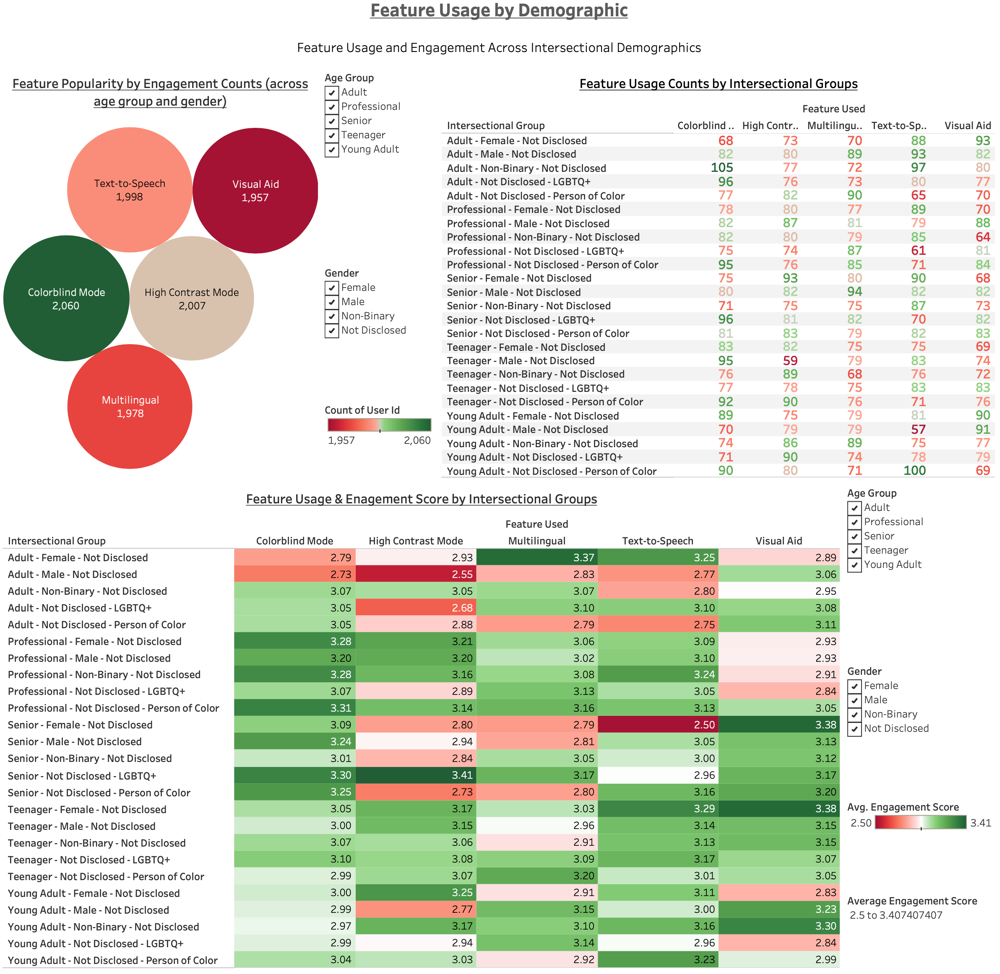
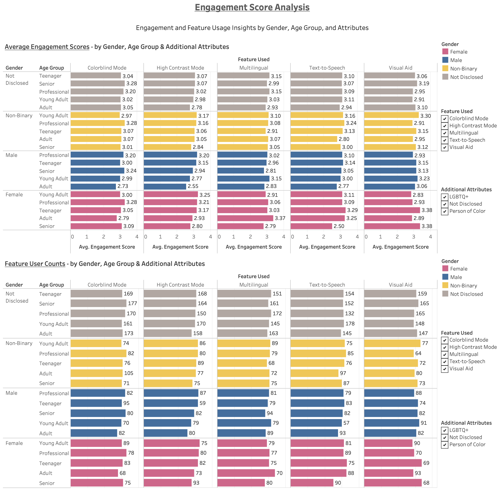

# Accessibility Features - User Engagement Analysis

This project analyzes **user engagement with accessibility features** using **Python (Pandas, Scipy), Tableau, and Jupyter Notebook** to uncover **accessibility trends and user behavior insights**. The study focuses on **data cleaning, exploratory data analysis (EDA), feature engineering, predictive modeling, and data visualization** to provide **actionable recommendations** for improving feature adoption and usability.

---

## 📌 Table of Contents

- [🎯 Objectives](#-objectives)
- [📌 Key Findings](#-key-findings)
- [📊 Tableau Dashboards](#-tableau-dashboards)
- [🔍 Analysis Breakdown](#-analysis-breakdown)
- [🛠️ Tools and Technologies](#-tools-and-technologies)
- [📈 Data Workflow](#-data-workflow)
- [🚀 Future Improvements](#-future-improvements)

---

## 🎯 **Objectives**

- **Analyze user engagement** with accessibility features across different user groups.
- **Detect and handle missing values** and **outliers** in the dataset.
- **Perform Exploratory Data Analysis (EDA)** to identify **feature adoption trends**.
- **Engineer new features** for better insights (e.g., high-accessibility users, intersectional groupings).
- **Build a predictive model** to classify high-accessibility users.
- **Visualize findings** using **Tableau dashboards**.

---

## 📌 Key Findings

### **1️⃣ Data Cleaning & Preparation**

✔ **10,000 rows & 8 columns** – dataset contained **no duplicate rows**.
✔ **40% missing values in `gender`** and **60% missing values in `additional_attributes`**, imputed as `"Not Disclosed"`.
✔ **Session duration outliers detected** using Isolation Forest (100 outliers found). **Kept to preserve valid user behavior.**
✔ **New Feature:** `high_accessibility_user` (users enabling ≥3 settings).
✔ **New Feature:** `intersectional_group` (combining `age_group`, `gender`, and `additional_attributes`).

### **2️⃣ Exploratory Data Analysis (EDA)**

✔ **Text-to-Speech & Visual Aid** had the **highest engagement scores (3.29–3.38)**, especially for **Female Teenagers (& Female Young Adults**).
✔ **Colorblind Mode was widely used by Female Professionals** (3.28), but intersectional analysis revealed **higher adoption among Professionals "Gender Not Disclosed - Person of Color"** (3.31).
✔ **Multilingual Feature engagement was highest among Female Adults (3.37), with lower engagement among Male Seniors (2.81).**

### **3️⃣ Feature Engineering & Predictive Modeling**

✔ **Average session duration per feature** → Multilingual users had the longest sessions (62.90 min).✔ **Average engagement scores by accessibility settings and user group** → Senior Non-Binary users with high accessibility settings had the highest engagement (3.328).✔ **Logistic Regression Model (51% accuracy)** → Most predictive factors:

- **Additional Attributes - Person of Color** (`0.10 weight`)
- **Age Group - Young Adult** (`0.07 weight`)

### **4️⃣ Actionable Recommendations**

✔ **Enhance Multilingual Feature for Non-Binary & Male Users** → Target low-engagement groups.
✔ **Increase Adoption of High-Contrast & Colorblind Mode for Adult Males** → Tailored campaigns for professional/education use.
✔ **Leverage Intersectional Data for Targeted Accessibility Enhancements** → Ensure settings support all **high-engagement user groups**.

---

## 📊 **Tableau Dashboards**

Click the image below to view **interactive Tableau dashboards**:

🔹 **Visualizes:**

- Feature engagement by user groups
- Session duration trends
- Accessibility feature adoption insights

---

## 🔍 **Analysis Breakdown**

### **1️⃣ Data Cleaning & Outlier Handling**

- **Checked for duplicates & ensured unique user IDs**.
- **Handled missing values** (imputed `gender` and `additional_attributes`).
- **Detected outliers in `session_duration`** and confirmed they reflected real user behavior.

### **2️⃣ Exploratory Data Analysis (EDA)**

- **Feature adoption trends by gender, age group, and accessibility settings**.
- **Intersectional insights uncovered hidden engagement patterns**.
- **Visualized engagement scores and feature popularity**.

### **3️⃣ Feature Engineering & Predictive Modeling**

- **Created key derived variables** (`high_accessibility_user`, `intersectional_group`).
- **Built a logistic regression model** to predict high-accessibility users.

---

## 🛠️ **Tools and Technologies**

✔ **Python (Pandas, NumPy, Matplotlib, Scipy)** → Data cleaning, EDA, feature engineering, predictive modeling.
✔ **Tableau Public** → Interactive visualizations & dashboarding.
✔ **Jupyter Notebook** → Code execution & structured analysis.

---

## 📈 **Data Workflow**

1. **Extract** → Loaded Excel dataset into **Pandas DataFrame**.
2. **Transform** → Data cleaning, missing value handling, and feature engineering.
3. **Analyze** → Exploratory data analysis & statistical insights.
4. **Model** → Logistic regression to classify high-accessibility users.
5. **Visualize** → Tableau dashboards for **user engagement insights**.

---

## 🚀 **Future Improvements**

✔ **Enhance predictive model performance** by exploring **Decision Trees and Support Vector Machines (SVM)** to improve classification and interpretability.  
   - **Decision Trees** → A simple yet powerful model that **segments data based on feature importance**, making it highly **interpretable** for identifying key accessibility factors.  
   - **Support Vector Machines (SVM)** → Works well with **high-dimensional data and smaller datasets**, making it **ideal for structured user engagement data**. It helps **define clear decision boundaries** between engaged and non-engaged users.  

✔ **Optimize dataset representation** by engineering additional features that capture deeper accessibility usage patterns.  
✔ **Leverage A/B testing insights** to refine engagement strategies and measure the effectiveness of different accessibility features.  
✔ **Develop automated reporting tools** to generate accessibility insights dynamically for stakeholders and decision-makers.  
